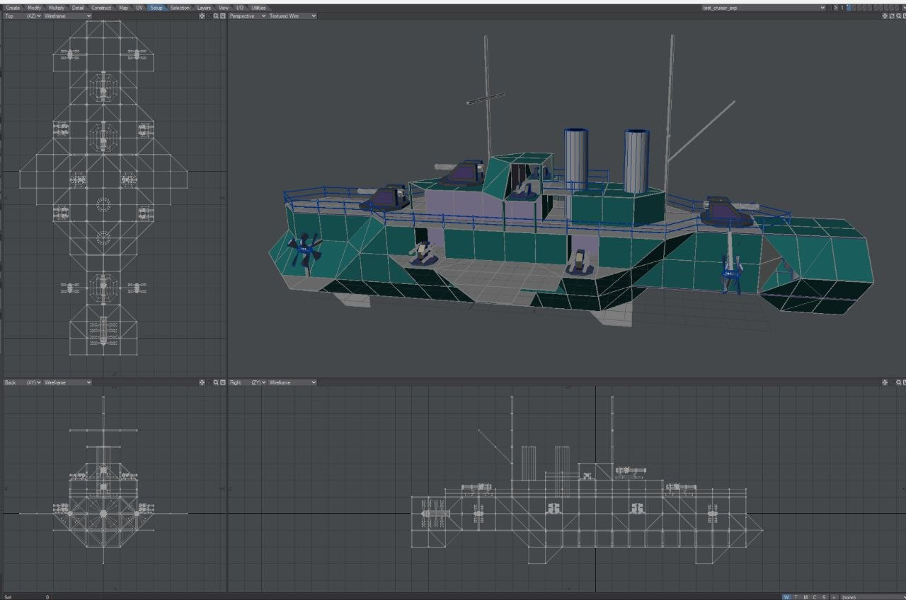
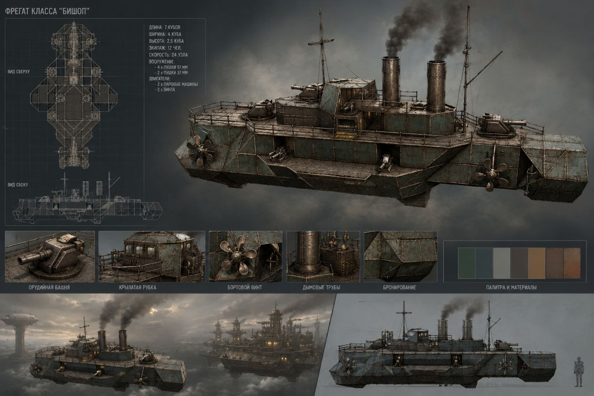

#Технология дизайна

## R&D Фаза
Content Pipiline имеет следующую основную идею: мир собирается из примитивов, симуляция отдельными слоями:
* графика
* кинематика
* верхние слои механики (видимость, нагрев, аэродинамика, все что придет в голову)
* симуляция механизмов
* управление

Процессы разработки
* создаем примитивов (меши, руками) Смотрим, какие вправила получаются
* мобираем руками из мешей тестовые объекты
* смотрим, какой получается формат описание конструкций (язык структур, например Q1)
* учимся загрузить в рендерилку примитивы и показывать конструкцию
* оживляем конструкцию кинематикой (тут же можно тестировать слои механики)
* из рендерилки собираем вьювер/эксплорер/редактор (помним про текстовый формат и LLM)

Все это итеративно

### Ручнная работа
Из заранее приготовленных примитивов вручную собран кораблик (LightWave 3D)

### Осматриваемся
Просим LLM попросить генератор картинок сделать концепт прямо по скрину из LW
